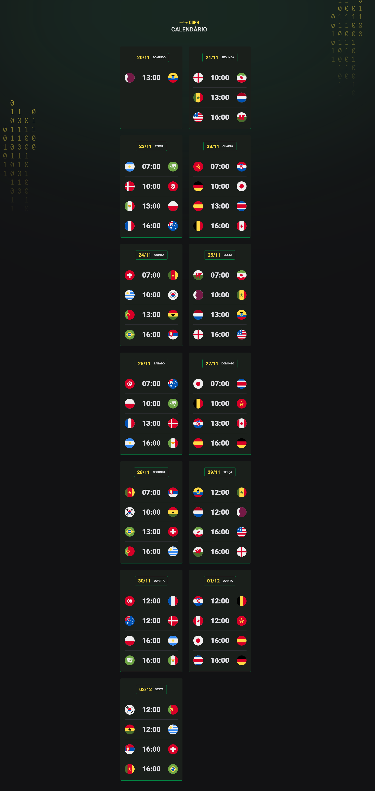

># Calendário de Jogos NLW_Copa 2022




>Trilha explorer NLW Copa 

Projeto desenvolvido a partir de linguagens, css, html, e javascript.
Cards com:
Datas
Horários
Países
Que disputarão em jogos de futebol, para termos o campeão do ano de 2022.
Jogos acontecerão no pais sede, Qatar.

>>Desbravando a programação! 😎

[Clique aqui para acessar](https://gracih.github.io/nlw_copa22/)

# 👩‍💻 Tecnologias

-HTML

-CSS

-JavaScript

-Git e GitHub

<br>
# Novidade 

###
*Primeiro contato com JavaScript, linguiagem que trabalha com mais inteligência nos projetos.

*No CSS, aplicamos variáveis ao projeto.
``` 
:root {
  --card-title-border-color: #746615;
  --card-color-primary: #f7dd43;
  --card-bg-color: #1d1c19;
  --bg: url(./assets/bg-yellow.svg);}
```

<br>
### ✉ Contato 😀
gracielle@outlook.com